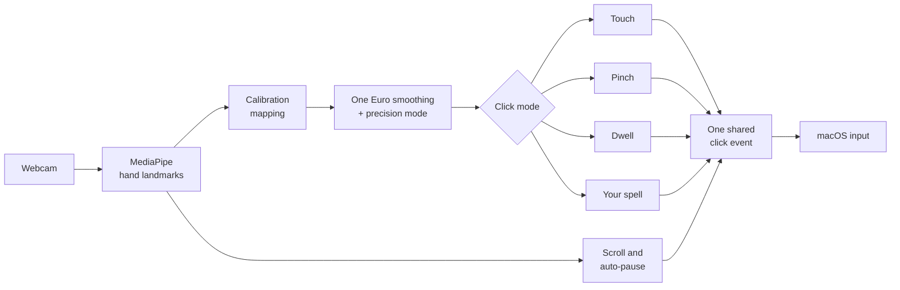

<div align="center">


### A webcam mouse that learns your hand, instead of making your hand learn it.

-1f2937?logo=apple&logoColor=white)


[Highlights](#highlights) · [Results](#measured-results) · [Gestures](#gestures) · [Comparison](#how-it-compares) · [Quick start](#quick-start) · [Architecture](#architecture)

</div>

---

Conjure turns a standard laptop webcam into a full mouse replacement for people with limited hand mobility: tremor, arthritis, partial paralysis, repetitive strain injury. Your hand moves the cursor, and you click the way you would on a touchscreen: tap with your index finger. Or pinch, hold still, or use a gesture you record yourself.

Every other webcam pointer ships a fixed set of gestures and expects your hand to adapt. **Conjure inverts that: any motion your hand can repeat reliably becomes a click.**

## Highlights

| | |
| --- | --- |
| **Touchscreen feel** | Point with your index finger, tap to click, double-tap, press and hold for a right click, press and move to drag. Nothing new to learn. |
| **Your own click gesture** | Record any motion three times, name it, and it becomes a click. It works anywhere in the frame and at any distance from the camera. |
| **Small, rested movements** | Range-of-motion calibration maps the area you can reach comfortably (about 3 inches, forearm on the table) to the whole screen. |
| **Steady under tremor** | One Euro smoothing plus a precision mode that slows the cursor as your hand slows, so small targets stay reachable. |
| **Clicks that don't misfire** | Size-normalized pinch, hysteresis, a hold time, and an open-fingers rule. Zero false clicks across every recorded session. |
| **Never stuck** | Can't pinch? Hold still to click (dwell). Hand drops out of view? Everything pauses within half a second. |
| **Private by design** | Video is processed on the laptop and never stored or sent. No account, no cloud. |

## Measured results

Measured on real recorded hand sessions ([`recordings/`](recordings/)) and reproducible with `python -m pytest`.

| | Typical webcam-mouse tutorial | **Conjure** |
| --- | :---: | :---: |
| False clicks in ~2.5 min of ordinary pointing (no click intended) | 41 | **0** |
| Cursor shake with the hand at rest | 4.8 px | **1.3 px** |
| Custom gesture recognized, 10 varied casts | not possible | **8 or more, within 500 ms** |
| Input frozen when the hand leaves view | never | **within 0.5 s, 13 of 13** |

> **Why taps don't misfire.** A tap only counts when your finger was pointing first and your hand is nearly still, the way you aim and then touch a phone screen. In the recorded sessions of ordinary movement, these rules turn 15 accidental "touches" into zero clicks.

> **Why tutorials misfire.** They follow the fingertip, which moves when you pinch. They measure the pinch in camera pixels, so leaning toward the camera "pinches". And they click the instant the fingers cross a line. Conjure's **tutorial mode** reproduces that behavior live, side by side with its own detector, so you can see the difference on screen.

## Gestures

| Your hand | Result |
| --- | --- |
| Point with your index finger | The cursor follows the knuckle at the base of that finger, so tapping never moves it |
| **Touch mode** *(default)*: tap (bend the finger and straighten it) | **Left click**, placed where your finger was before the tap |
| Tap twice | **Double-click** |
| Press and hold still for 0.7 s | **Right click** (a ring fills while you hold) |
| Press, pause, then move | **Drag**; straighten to drop |
| **Pinch mode**: thumb to index, other fingers open, then release | **Left click** (thumb to middle finger: right click; pinch and move: drag) |
| Hold still for 0.8 s *(dwell mode)* | **Left click**, after a countdown ring fills |
| Your recorded gesture *(spell mode)* | **Left click**, with the spell's name shown and spoken |
| Two fingers up (V), then lift or lower your hand | **Scroll** |
| Hand out of view | **Pause**: nothing can click while you rest |

On screen you always see a status indicator (tracking, near edge, paused, no hand), a pinch progress dot, the dwell countdown ring, and a click sound for every click.

## How it compares

| | Apple Head Pointer | Google Project Gameface | AirTouch | Tutorials | **Conjure** |
| --- | :---: | :---: | :---: | :---: | :---: |
| Tracks | Head | Head + face | Hand | Hand | **Hand** |
| Record your own gesture as a click | ✗ | ✗ | ✗ ¹ | ✗ | **✓** |
| Per-user range-of-motion calibration | ✗ | ✗ | ? | ✗ | **✓** |
| Click without pinching | ✓ dwell | ✓ face | ? | ✗ | **✓** |
| Free | ✓ | ✓ | ✗ | ✓ | **✓** |
| On-device | ✓ | ✓ | ✓ | ✓ | **✓** |
| On macOS | ✓ | ✗ | ✗ ² | ✓ | **✓** |

<sub>¹ Consumer tiers map from a 15-gesture library; custom training is sold to OEMs. ² "On the way" per the vendor. ? = not documented. Verified October 2026; sources in [`PITCH.md`](PITCH.md).</sub>

## Quick start

**Requirements:** a Mac with Apple Silicon, Python 3.11 or newer, a webcam.

**1. Install**

```bash
git clone https://github.com/hiratinspace/Conjure.git
cd Conjure
python3 -m venv .venv && source .venv/bin/activate
pip install -r requirements.txt
```

**2. Grant permissions**

```bash
python scripts/check_permissions.py
```

macOS asks for **Camera** and **Accessibility** access for your terminal app. Grant both, then quit and reopen the terminal. The script verifies that a real click lands, because without Accessibility the cursor can move while clicks are silently dropped.

**3. Run**

```bash
python main.py --spellbook
```

This opens the Conjure panel, the on-screen overlay, and the spellbook demo page in your browser.

**4. First session**

1. Press **Calibrate**, rest your forearm, and trace the edges of a small, comfortable area.
2. Point and tap: Conjure starts in **Touch** mode. Other modes in the panel: **Pinch**, **Dwell**, or **Spell** (press **Record spell** first).
3. Work through the spellbook pages.

**Optional: spoken feedback.** Set `ELEVENLABS_API_KEY` in your shell for ElevenLabs voices. Without it, Conjure uses the built-in macOS voice.

<details>
<summary><b>Command-line options and keyboard shortcuts</b></summary>

| Flag | What it does |
| --- | --- |
| `--spellbook` | Also open the offline demo page |
| `--preview` | Show the camera view with hand landmarks and live state |
| `--replay FILE` | Run from a recorded session instead of the camera (no real input) |
| `--no-ui` | Minimal fallback: no overlay, OpenCV preview only |
| `--venue FILE` | Threshold overrides for a demo venue (default `venue.json`) |
| `--profile FILE` | Where calibration, the spell, and settings are saved |

Keys in the preview window: `p` hide preview, `m` cycle click mode, `g` record a spell, `c` calibrate, `s` settings panel, `t` tutorial mode, `k` metrics, `q` quit.

</details>

## Privacy

- All video is processed on the laptop by MediaPipe and is never stored or sent anywhere.
- The only network code is the optional ElevenLabs text-to-speech request, isolated in a single module. A test fails if any other module touches the network.
- MediaPipe is pinned to 0.10.33 because a newer release added usage telemetry. A test guards against it returning.

## Architecture

A single Python process. A worker thread runs the per-frame pipeline, and the main thread runs the interface: a transparent, click-through overlay and a settings panel with large targets that can be operated with Conjure itself.



Everything after hand tracking also runs from recorded sessions, so the acceptance tests (zero false clicks, jitter, calibration reach, pause timing) run headless against real hand data.

<details>
<summary><b>Project layout</b></summary>

```
main.py                 entry point and wiring
config.py               every tunable, with the measurement behind it
venue.json              demo-day threshold overrides
pipeline/               one module per stage: tracking, filter, pinch, dwell,
                        gestures, calibration, overlay, settings panel, voice
spellbook/index.html    offline demo page
recordings/             real hand sessions used as test fixtures
scripts/                permission check, session recorder, diagnostics, voice clips
tests/                  254 headless tests
```

</details>

## Testing

```bash
python -m pytest -q   # 254 tests, about 8 seconds, no camera needed
```

## Documentation

| File | Contents |
| --- | --- |
| [`PITCH.md`](PITCH.md) | Measured numbers, the sourced comparison, and lines for the demo |
| [`RUNBOOK.md`](RUNBOOK.md) | Demo-day checklists, the 3-minute script, and the fallback plan |
| [`PROGRESS.md`](PROGRESS.md) | Build status, decisions, and the measurements behind them |
| [`CLAUDE.md`](CLAUDE.md) | Developer guide to the architecture and conventions |

## Roadmap

Built in 18 hours, so deliberately focused: macOS only, one screen, one hand, one recorded spell. Next:

- [ ] On-screen keyboard for text entry
- [ ] Several spells mapped to different actions
- [ ] Windows and Linux support (the stack is cross-platform; only macOS is built and tested)

## Acknowledgements

Built solo in an 18-hour hackathon. Hand tracking by [MediaPipe](https://ai.google.dev/edge/mediapipe), smoothing by the [One Euro filter](https://gery.casiez.net/1euro/) (Casiez et al., 2012), and voice by [ElevenLabs](https://elevenlabs.io).
