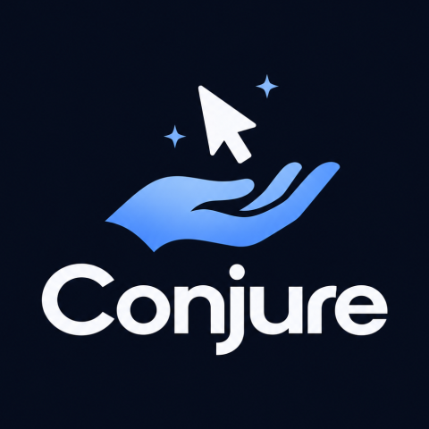
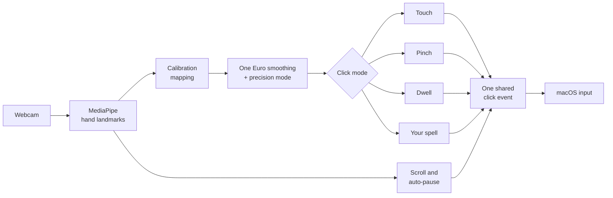

<div align="center">



### A webcam mouse that learns your hand, instead of making your hand learn it.

-1f2937?logo=apple&logoColor=white)


[Highlights](#highlights) · [Results](#measured-results) · [Gestures](#gestures) · [Comparison](#how-it-compares) · [Quick start](#quick-start) · [Architecture](#architecture)

</div>

---

Conjure turns a standard laptop webcam into an alternative pointer for people who can lift one hand but find a mouse hard or painful: tremor, arthritis, partial paralysis, repetitive strain injury. Your hand moves the cursor, and you click with a quick pinch (the same gesture Apple Vision Pro and Meta Quest use), by holding still, by tapping like a touchscreen, or with a gesture you record yourself.

Every other webcam pointer ships a fixed set of gestures and expects your hand to adapt. **Conjure inverts that: any motion your hand can repeat reliably becomes a click.**

## Highlights

| | |
| --- | --- |
| **Natural pinch** | A quick thumb-to-index pinch clicks, like on Vision Pro or Quest. If a pinch is not counted, the dot by the cursor turns red and says why. |
| **Your own click gesture** | Record any motion three times, name it, and it becomes a click. It works anywhere in the frame and at any distance from the camera. |
| **Feels like a mouse** | Your hand works like a mouse on a small pad: slow, careful moves are scaled down for precision and quick flicks go far, so a few inches cover the whole screen. Drop your hand out of view and back to "lift the mouse". |
| **Steady under tremor** | Tremor-speed motion is ignored entirely: on a recorded resting hand the cursor stays still in 94% of frames and wanders 3 px in 16 seconds. |
| **Clicks you mean** | A pinch counts only when it snaps shut from open; accidental contacts drift. Zero false clicks across every recorded no-click session, measured. |
| **Any click without a pinch** | Pick the next action on a big-button bar (Left, Right, Double, Drag) by dwell or any click, then click the target. Drag lock means nobody has to hold a pinch. |
| **Tuned to your hand** | Press Tune: rest five seconds, then pinch three times. Conjure sets its tremor threshold, its pinch speed window, and how far your fingertips need to close from *your* hand, not from a default. |
| **A spell you can trust** | After you record a gesture, Conjure asks you to cast it three times and reports "recognized 3 of 3" before it is used. If not, it tells you to record a bigger motion. |
| **Never stuck** | Can't pinch? Hold still to click (dwell). Hand drops out of view? Everything pauses within half a second. Camera unplugged? Conjure waits and reconnects. |
| **Private by design** | Video is processed on the laptop and never stored or sent. No account, no cloud. |

## Measured results

Measured on real recorded hand sessions ([`recordings/`](recordings/)) and reproducible with `python -m pytest`.

| | Typical webcam-mouse tutorial | **Conjure** |
| --- | :---: | :---: |
| False clicks in 2.4 min of ordinary pointing (no click intended) | 17 | **0** |
| Real pinches recognized (111 recorded on the demo laptop) | n/a | **98 (88%); 41 of 43 in the latest session** |
| Your own numbers | | The spellbook's **Measure yourself** page runs a 12-target test and reports hit time, misses, and throughput in bits/s |
| Cursor shake with the hand at rest | 4.8 px | **1.3 px** |
| Custom gesture recognized, 10 varied casts | not possible | **8 or more, within 500 ms** |
| Input frozen when the hand leaves view | never | **within 0.5 s, 13 of 13** |

> **How Conjure tells a pinch from an accident.** A relaxed hand drifts the thumb against the index finger all the time, and many people pinch with their other fingers curled, so finger shape alone can't decide. What differs is the motion: a deliberate pinch snaps shut from open in under 200 ms (measured: 33 to 167 ms), while an accidental contact drifts shut slowly or never started open. Conjure counts only the snap, held at least 80 ms, outside a fast sweep.

> **Why tutorials misfire.** They follow the fingertip, which moves when you pinch. They measure the pinch in camera pixels, so leaning toward the camera "pinches". And they click the instant the fingers cross a line. Conjure's **tutorial mode** reproduces that behavior live, side by side with its own detector, so you can see the difference on screen.

## Gestures

| Your hand | Result |
| --- | --- |
| Move your hand, like a mouse on a small pad | The cursor moves with it: slowly for precision, farther with a quick flick |
| Drop your hand out of view, bring it back elsewhere | "Lifting the mouse": the cursor stays put, so you can re-center your hand |
| **Pinch mode** *(default)*: a quick thumb-to-index pinch, any hand shape | **Left click**, placed where the cursor was before you pinched |
| Two pinches within 0.8 s | **Double-click**, on exactly the same spot even if your hand drifted |
| Thumb to middle finger | **Right click** |
| Pinch, hold, and move | **Drag** |
| **Touch mode**: point, then tap (bend and straighten the index finger) | **Left click**; tap twice to double-click, press and hold 0.7 s to right-click, press, pause, and move to drag |
| Hold still for 0.8 s *(dwell mode)* | **Left click**, after a countdown ring fills |
| Your recorded gesture *(spell mode)* | **Left click**, with the spell's name shown and spoken |
| Two fingers up (V), then lift or lower your hand | **Scroll** |
| Hand out of view | **Pause**: nothing can click while you rest |
| Any click after choosing **Right**, **Double**, or **Drag** on the action bar | That action, once, then back to left click (**Keep** makes it stay) |
| Any click while a drag is locked | **Drops** it |

**Two pointer styles.** *Mouse* (default) is relative with acceleration, as above. *Direct* maps a small area you trace once (range-of-motion calibration, about 3 inches with the forearm rested) onto the whole screen, so each hand position is a fixed screen position. Switch with **Pointer** in the panel.

On screen you always see a status indicator (tracking, near edge, paused, no hand), a pinch progress dot, the dwell countdown ring, and a click sound for every click.

## How it compares

| | Apple Head Pointer | Google Project Gameface | AirTouch | Tutorials | **Conjure** |
| --- | :---: | :---: | :---: | :---: | :---: |
| Tracks | Head | Head + face | Hand | Hand | **Hand** |
| Record your own gesture as a click | ✗ | ✗ | ✗ ¹ | ✗ | **✓** |
| Per-user range-of-motion calibration | ✗ | ✗ | ? | ✗ | **✓** |
| Click without pinching | ✓ dwell | ✓ face | ? | ✗ | **✓** |
| Free | ✓ | ✓ | ✗ | ✓ | **✓** |
| On-device | ✓ | ✓ | ✓ | ✓ | **✓** |
| On macOS | ✓ | ✗ | ✗ ² | ✓ | **✓** |

<sub>¹ Consumer tiers map from a 15-gesture library; custom training is sold to OEMs. ² "On the way" per the vendor. ? = not documented. Verified against each product's documentation in October 2026.</sub>

## Quick start

**Requirements:** a Mac with Apple Silicon, Python 3.11 or newer, a webcam.

**1. Install**

```bash
git clone https://github.com/hiratinspace/Conjure.git
cd Conjure
python3 -m venv .venv && source .venv/bin/activate
pip install -r requirements.txt
```

**2. Grant permissions**

```bash
python scripts/check_permissions.py
```

macOS asks for **Camera** and **Accessibility** access for your terminal app. Grant both, then quit and reopen the terminal. The script verifies that a real click lands, because without Accessibility the cursor can move while clicks are silently dropped.

**3. Run**

```bash
python main.py --spellbook
```

This opens the Conjure panel, the on-screen overlay, and the spellbook demo page in your browser.

**4. First session**

1. Press **Tune**: rest your forearm and hold still for five seconds, then pinch three times naturally. The thresholds are now yours.
2. Move your hand like a mouse on a small pad. If you run out of room, drop your hand out of view and bring it back ("lift the mouse"). **Feel** in the panel (Precise, Balanced, Fast) and **Sensitivity** adjust it.
3. Pinch to click: Conjure starts in **Pinch** mode. Other modes in the panel: **Touch**, **Dwell**, or **Spell** (press **Record spell** first). For a right click, double-click, or drag without a pinch, choose it on the action bar first.
4. Work through the spellbook pages, then **Measure yourself**.

**Optional: spoken feedback.** Set `ELEVENLABS_API_KEY` in your shell for ElevenLabs voices. Without it, Conjure uses the built-in macOS voice.

<details>
<summary><b>Command-line options and keyboard shortcuts</b></summary>

| Flag | What it does |
| --- | --- |
| `--spellbook` | Also open the offline demo page |
| `--preview` | Show the camera view with hand landmarks and live state |
| `--replay FILE` | Run from a recorded session instead of the camera (no real input) |
| `--no-ui` | Minimal fallback: no overlay, OpenCV preview only |
| `--venue FILE` | Threshold overrides for a demo venue (default `venue.json`) |
| `--profile FILE` | Where calibration, the spell, and settings are saved |

**F8** anywhere pauses or resumes Conjure (a panic key for live demos; needs Input Monitoring for the terminal app, which the permission check tests). Each run writes a log to `logs/`.

Keys in the preview window: `p` hide preview, `m` cycle click mode, `g` record a spell, `c` calibrate, `s` settings panel, `t` tutorial mode, `k` metrics, `q` quit.

</details>

## Privacy

- All video is processed on the laptop by MediaPipe and is never stored or sent anywhere.
- The only network code is the optional ElevenLabs text-to-speech request, isolated in a single module. A test fails if any other module touches the network.
- MediaPipe is pinned to 0.10.33 because a newer release added usage telemetry. A test guards against it returning.

## Architecture

A single Python process. A worker thread runs the per-frame pipeline, and the main thread runs the interface: a transparent, click-through overlay and a settings panel with large targets that can be operated with Conjure itself.



Everything after hand tracking also runs from recorded sessions, so the acceptance tests (zero false clicks, jitter, calibration reach, pause timing) run headless against real hand data.

<details>
<summary><b>Project layout</b></summary>

```
main.py                 entry point and wiring
config.py               every tunable, with the measurement behind it
venue.json              demo-day threshold overrides
pipeline/               one module per stage: tracking, filter, pinch, dwell,
                        gestures, calibration, overlay, settings panel, voice
spellbook/              offline demo page and the target-practice test
recordings/             real hand sessions used as test fixtures
scripts/                permission check, session recorder, diagnostics, voice clips
tests/                  308 headless tests
```

</details>

## Testing

```bash
python -m pytest -q   # 308 tests, about 8 seconds, no camera needed
```

## Roadmap

Built in 18 hours, so deliberately focused: macOS only, one screen, one hand, one recorded spell. Next:

- [ ] On-screen keyboard for text entry
- [ ] Several spells mapped to different actions
- [ ] Windows and Linux support (the stack is cross-platform; only macOS is built and tested)

## Acknowledgements

Built solo in an 18-hour hackathon. Hand tracking by [MediaPipe](https://ai.google.dev/edge/mediapipe), smoothing by the [One Euro filter](https://gery.casiez.net/1euro/) (Casiez et al., 2012), and voice by [ElevenLabs](https://elevenlabs.io).
